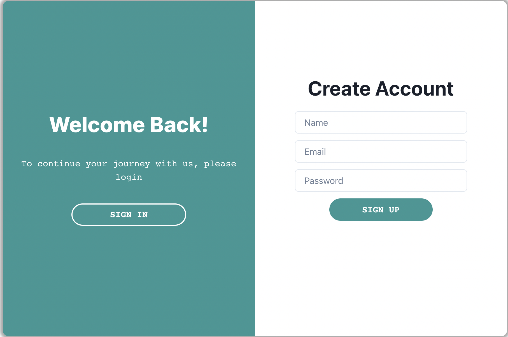

#  next-auth-2fa-example

Example showing a custom sign-in page using NextAuth.js with Two Factor Authentication using [TOTP algorithm](https://en.wikipedia.org/wiki/Time-based_one-time_password).

## Features

- Users can manage 2FA
- Enforce 2FA during login
- First class integration with NextAuth.js




## 🚀 Getting Started

First, run the development server:

1. Install dependencies

```bash
$ npm Install
```

2. Start dev server

```bash
$ npm run dev
# or
$ yarn dev
```

Open [http://localhost:3000](http://localhost:3000) with your browser to see the result.

## 🛡 NextAuth.js

You will find more examples under https://next-auth.js.org/.

## Learn More

To learn more about Next.js, take a look at the following resources:

- [Next.js Documentation](https://nextjs.org/docs) - learn about Next.js features and API.
- [Learn Next.js](https://nextjs.org/learn) - an interactive Next.js tutorial.

You can check out [the Next.js GitHub repository](https://github.com/vercel/next.js/) - your feedback and contributions are welcome!

## Deploy on Vercel

The easiest way to deploy your Next.js app is to use the [Vercel Platform](https://vercel.com/new?utm_medium=default-template&filter=next.js&utm_source=create-next-app&utm_campaign=create-next-app-readme) from the creators of Next.js.

Check out our [Next.js deployment documentation](https://nextjs.org/docs/deployment) for more details.
